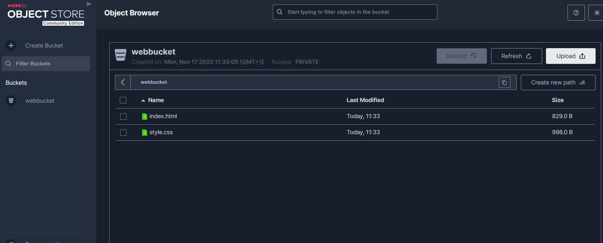

# TP Cloud 1 – Introduction au Cloud avec OpenTofu et MinIO

## 1. Objectif pédagogique

Découvrir les concepts fondamentaux du Cloud Computing avec :  
- **OpenTofu** : gestion déclarative de l’infrastructure (IaC)  
- **MinIO** : stockage objet compatible S3  

Le TP permet de :  
- Créer un bucket MinIO via OpenTofu  
- Uploader des fichiers `index.html` et `style.css`  
- Configurer le bucket comme site web statique  

## 2. Structure du projet

tp1-minio/
│ README.md
│ main.tf
│ variables.tf
│ terraform.tfvars
│ index.html
│ style.css
│ .terraform/
│ terraform.tfstate
minio-data/

- `main.tf` : définition de l’infrastructure (bucket + objets)  
- `variables.tf` : définition des variables configurables  
- `terraform.tfvars` : valeurs spécifiques pour le TP  
- `index.html` et `style.css` : fichiers du site web statique  
- `minio-data/` : dossier contenant les données MinIO

---

## 3. Prérequis

- OpenTofu ([docs](https://opentofu.org/docs/))  
- MinIO ([binaire](https://dl.min.io/server/minio/release/))  
- PowerShell ou cmd sur Windows  

Téléchargez les binaires correspondants depuis les sites officiels.
---

## 4. Lancement du serveur MinIO

1. Créez un dossier de travail :
 mkdir ~/minio-data
2. Lancez le serveur MinIO localement :
minio server ~/minio-data --console-address ":9001"

3. Accédez à la console via http://localhost:9001.
 Par défaut, l’utilisateur est 'minioadmin' et le mot de passe 'minioadmin'.

## 5. Initialisation et déploiement

1. Aller dans le projet tp1-minio :

`cd "X\tp1-minio"`

2. Initialiser le projet :

`tofu init`

Vérifier le plan :

`tofu plan`

Appliquer les changements :

`tofu apply`

Confirmer avec yes

Bucket webbucket créé

`index.html` et `style.css` uploadés

ACL du bucket : `public-read`

## 6. Vérification

### 1. Console MinIO : http://127.0.0.1:9001

### 2. Vérifier le bucket `webbucket` et les fichiers

### 3. Tester l’accès public : `http://127.0.0.1:9000/webbucket/index.html`

## 7. . Nettoyage et cycle IaC

tofu destroy   # supprime l’infrastructure
tofu apply     # reconstruit l'infrastructure

## 8. Commandes OpenTofu utiles

| Commande       | Description                 |
| -------------- | --------------------------- |
| `tofu init`    | Initialise le projet        |
| `tofu plan`    | Prévisualise les ressources |
| `tofu apply`   | Applique les changements    |
| `tofu destroy` | Supprime les ressources     |
| `tofu console` | Inspecte variables et état  |

## 9. Photo de mon site statique 

## 10. Photo du `WebBucket` : 

## 11. Expérience Detaillée 
Lors de ce TP, j’ai d’abord créé les fichiers index.html et style.css pour constituer le site web statique que j’allais héberger dans MinIO. Ensuite, j’ai construit le fichier main.tf pour définir l’infrastructure avec OpenTofu : j’y ai inclus la création du bucket et l’upload des fichiers. Pour rendre le projet plus propre et sécurisé, j’ai défini des variables dans variables.tf et je les ai utilisées dans main.tf et terraform.tfvars afin de ne pas stocker directement des informations sensibles (comme l’utilisateur et le mot de passe MinIO) dans le code principal. Cette approche m’a permis de comprendre le fonctionnement de l’Infrastructure as Code et de voir comment gérer proprement la configuration d’un environnement cloud local.